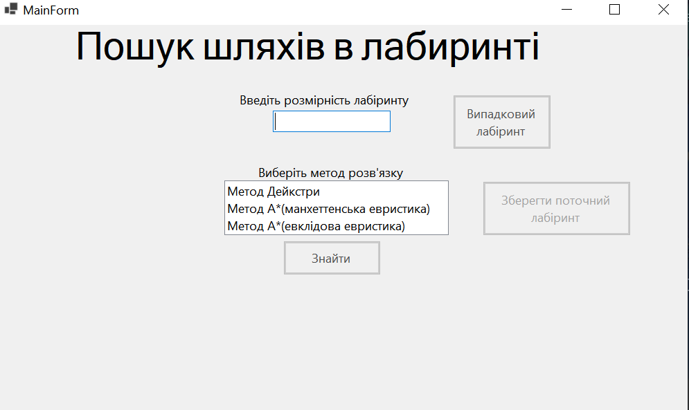
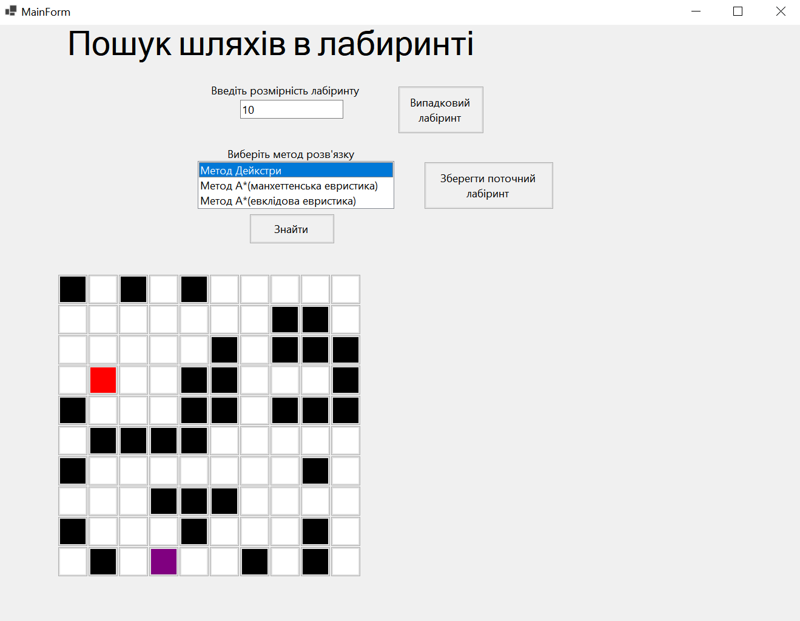
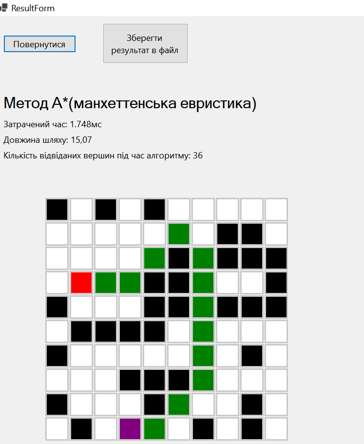

# Pathfinding Algorithms Visualizer

A desktop application designed to visualize and compare pathfinding algorithms (A\* and Dijkstra) in real-time. The application allows users to generate mazes, draw obstacles, and observe how different algorithms traverse the graph to find the shortest path.

## 🚀 Features

- **Multiple Algorithms:**
  - **A\* (A-Star):** Uses heuristics (Manhattan/Euclidean) for fast pathfinding.
  - **Dijkstra:** Guarantees the shortest path by exploring all weighted nodes equally.
- **Interactive Map:** Users can draw walls, place start/end points, and reset the grid dynamically.
- **Maze Generation:** Ability to save/load maze configurations.
- **Performance Metrics:** Displays path cost, time taken, and the number of visited nodes.

## 🛠 Tech Stack

- **Language:** C# (.NET)
- **GUI:** Windows Forms (WinForms)
- **Concepts:** Graph Theory, Priority Queues, Heuristics

## 📂 Project Structure

- `code/`: Source code for the application and logic library.
- `docs/`: Class diagrams and technical documentation.

## ▶️ How to Run

1. Open `code/coursework.sln` in Visual Studio.
2. Build the solution.
3. Run `WinForms` project.

## Demo

| Initial Main Screen                          | Fulfilled Main Screen                            | Result                      |
| -------------------------------------------- | ------------------------------------------------ | --------------------------- |
|  |  |  |
